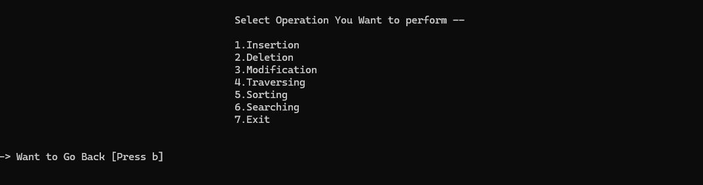
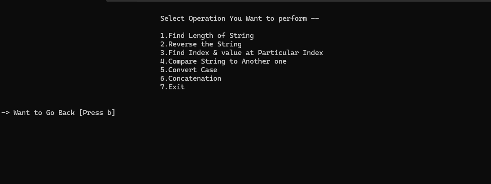

# 💻 Java Console Toolkit

This is a **Java console-based interactive application** that offers 3 modules:

1. **Array Operations** – Insertion, Deletion, Modification, Sorting, Searching, Traversing.
2. **String Manipulations** – Reverse, Length, Index Finding, Case Conversion, Comparison, Concatenation.
3. **Pattern Printing** – Includes common number/star/triangle-based patterns.

---

## 🛠 Technologies Used
- Java (Core)
- Console-based UI (with formatted output and input)
- Structure-based programming

---

## 🚀 Features

### ✅ Array Module:
- Insert at beginning, end, or position
- Delete from beginning, end, or position
- Modify values
- Sorting (Bubble, Selection, Insertion)
- Searching (Linear & Binary)
- Traverse and display array

### ✅ String Module:
- Length of string
- Reverse (word-wise or character-wise)
- Find index or value
- Compare strings (with or without case sensitivity)
- Convert case (uppercase/lowercase)
- Concatenation

### ✅ Pattern Module:
- Square (filled/hollow)
- Triangle (star/number/zero-one)
- Rhombus
- Diamond
- Number pyramids, etc.

---

## 📷 Screenshots
### 🧩 Array Module:


### 🔡 String Module:



## ▶️ How to Run
1. Compile:
   ```bash
   javac arr.java
2. Run:
java arr

## 🧠 **Author**
**Preksha**  
**3rd Year BCA Student**  
**[GitHub Profile](https://github.com/preksha1178)**


---

## 📌 Resume Project Description (Short & Impactful):

> **Java Console Toolkit** – Built a menu-driven Java console application supporting array operations (CRUD, sort, search), string manipulations (reverse, case, compare), and various star/number pattern generation using core Java and structured programming.

---
